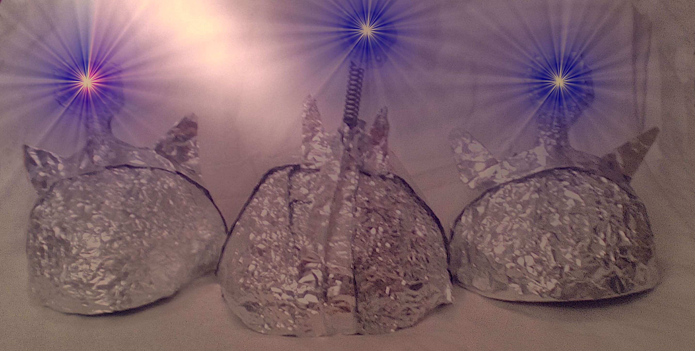

# «Wahnhafte Folienkartoffeln»
## Eine kurze Abhandlung, wie durch Propagandatechniken versucht wird differenzierte Auseinandersetzungen zu unterbinden. 

>> *»Wie Edward Bernays in seinem Buch Propaganda schon 1928 erklärte, kann 
>> man das Denken der Öffentlichkeit ganz genauso dirigieren, wie eine 
Armee die Körper ihrer Männer dirigiert. Aber nur so lange, wie die gelenkten 
Menschen sozusagen schlafen und sich dieser Steuerung gar nicht bewusst sind. 
Wenn sie aber aufwachen und die Realität des Informationskrieges erkennen, 
wird es viel schwieriger, sie zu lenken. Dann funktioniert die Regel von 
Bernays nicht mehr[...].«* (Jens Wernicke)[[¹](https://www.rubikon.news/artikel/vorsicht-verschworungstheorie)]

Wer sich etwas eingehender mit dem Thema Kriegspropaganda beschäftigt hat, dem sollte aus der Geschichte bekannt sein, wie sogenannte *Entmenschlichungsbegriffe* benutzt wurden, um anfänglich erst einmal Menschengruppen zu diskreditieren, dann gesellschaftlich auszugrenzen und später die Anwendung von Gewalt bis hin zur Tötung zu rechtfertigen.

In Propagandafilmen des Naziregimes *(dem Propagandaminister Göbbels war das 
oben genannte Buch von Bernays ja bekannt)*[[²](https://en.wikipedia.org/wiki/Edward_Bernays#cite_note-79)] wurden Juden als *»gefährliche 
Untermenschen*« bis hin zu *»Ratten«* bezeichnet (beispielsweise in dem Propagandafilm [*»Der ewige Jude«*](https://de.wikipedia.org/wiki/Der_ewige_Jude) von 1940)[[³](https://de.wikipedia.org/wiki/Der_ewige_Jude)]. Auch im Vietnamkrieg wurden Vietnamesen von den amerikanischen Agressoren zu »Termiten« degradiert.

Mit einem gewissen Grade an Bewusstwerdung dessen, was in diesen eklatanten Beispielen vor sich geht, sollte man meines Erachtens nach sehr vorsichtig damit sein, solche Entmenschlichungsbegriffe anzuwenden, selbst wenn einem aus welchen Gründen auch immer eine intellektuelle oder einfach differenzierte Auseinandersetzung mit entgegengesetzten Meinungen, Gesinnungen oder Ethnien nicht möglich ist. Was in den oben genannten Beispielen betrieben wird, indem Menschen als zu solchen Tierarten zugehörig bezeichnet werden, die bei der Bevölkerung eine Assoziation von *lästig* bis hin zu *hygienisch bedenklich* oder *gefährlich* auslöst, endet dann in der Geschichte in ihrer letzten Konsequenz, der hemmungslosen Tötung, als sei sie die einfache Befreiung von einer Plage.

Natürlich ist die Wahl einer Begrifflichkeit wie «Folienkartoffel» noch nicht gleichzusetzen mit der oben dargestellten Propaganda und den daraus resultierenden Konsequenzen. **Mir geht es in erster Linie darum, vor einer ähnlichen Systematik zu warnen.** Auf die Frage, wie es dazu kommt, dass selbst jene, denen eine differenzierte Auseinandersetzung zuzutrauen wäre, sich solch einfältiger Techniken bedienen, komme ich zu folgendem Ergebnis. Ich bin davon überzeugt, dass dies in den meisten Fällen völlig unbewusst geschieht und Ausdruck eines Zustandes ist, bei dem das Gedankenleben von einer aufgebauschten Emotionalität zurückgedrängt, bzw. übertönt wird.

Es findet somit kaum noch eine gedankliche Auseinandersetzung mit dem Thema statt, dem man mit Hilfe des Hinzuziehens von Tatsachen irgendwie begegnen könnte. Gleichzeitig entsteht aber ein Feindbild, das mit einer abwertenden Begrifflichkeit stigmatisiert wird. Dies gleicht viel eher einem Wahngebäude, dem man inhaltlich nichts entgegnen kann, weil es sich in erster Linie um eine Konsolidierung unreflektierter Emotionen handelt, die in solchen Begrifflichkeiten zusammengefasst werden.

Zur eigenen Absicherung wird dann die eigentlich nötige Selbstdiagnose des *Wahnhaften*, der abgewerteten Gegnerschaft unterstellt. Auch hier werden keine Beispiele genannt, mit denen man sich durch die Beschreibung von Begebenheiten oder Äußerungen entsprechender Personen zumindest auf ein objektives Minimum bezüglich irgendwelcher Tatsachen einigen könnte.

Ich sehe dadurch meine These untermauert, dass es sich bei der Wahndiagnose 
eigentlich um eine nach außen projizierte Selbstwahrnehmung handelt.[[⁴](https://de.wikipedia.org/wiki/Projektion_(Psychoanalyse))] Diese wird durch Umkehrung, das heißt durch das Pathologisieren der anderen Meinung auf niederster Ebene, zur Technik der Diskreditierung und Diskussionsverweigerung. Dadurch wird aber eigentlich nur die eigene Hilflosigkeit gegenüber einem bestimmten Themenkomplex zum Ausdruck gebracht.

Die Liste an Beispielen diskreditierender Artikel, die auf inhaltliche Auseinandersetzung weitestgehend verzichten, dürfte sehr lang sein.
Ein exzellenter Beispielartikel, zu dem sich eine gesonderte Auseinandersetzung mit dem Thema *Deskreditierungstechniken* lohnen würde, wurde auf heise.de veröffentlicht.
Dieser zeichnet sich durch eine besondere Kreativität in dieser Richtung und die Wortschöpfung, bzw. Verwendung des Wortes *»Folienkartoffel«* aus.[[⁵](https://www.heise.de/tp/features/Die-Verbrechen-des-Bill-Gates-4727474.html)]
Hiermit wird versucht, den in den *klassischen Medien* oft verwendeten Begriff der sogenannten *»Aluhüte«* an Polemik zu überbieten, was ihm durchaus auch gelingt.
Er impliziert auch gleich einen Umgang, der den Lesern wohl weitestgehend nicht zu Bewusstsein kommt, aber ihrer oben dargestellten Hilflosigeit in der Auseinandersetzung einen emotionalen Blitzableiter zur Verfügung stellt. Die *Kartoffel*, die sinnbildlich für den *Deutschen* steht, wird in Alufolie verpackt und auf den Grill gelegt. Über Techniken nachzudenken, die zum Überprüfen der Gare verwendet werden, würde ich an dieser Stelle denen überlassen, die sich unreflektiert solcher Analogien bedienen. 
 

**Nathanael Meister** *(1. Juni, 2020)*
___________________________________________

¹ [https://www.rubikon.news/artikel/vorsicht-verschworungstheorie](https://www.rubikon.news/artikel/vorsicht-verschworungstheorie)  
² [https://en.wikipedia.org/wiki/Edward_Bernays#cite_note-79](https://en.wikipedia.org/wiki/Edward_Bernays#cite_note-79)  
³ [https://de.wikipedia.org/wiki/Der_ewige_Jude](https://de.wikipedia.org/wiki/Der_ewige_Jude)  
⁴ [https://de.wikipedia.org/wiki/Projektion_(Psychoanalyse)](https://de.wikipedia.org/wiki/Projektion_(Psychoanalyse))  
⁵ [https://www.heise.de/tp/features/Die-Verbrechen-des-Bill-Gates-4727474.html](https://www.heise.de/tp/features/Die-Verbrechen-des-Bill-Gates-4727474.html)

 Dieses Werk ist lizenziert unter einer <a rel="license" href="http://creativecommons.org/licenses/by-nc-nd/4.0/">Creative Commons Namensnennung - Nicht kommerziell - Keine Bearbeitungen 4.0 International Lizenz</a>.
